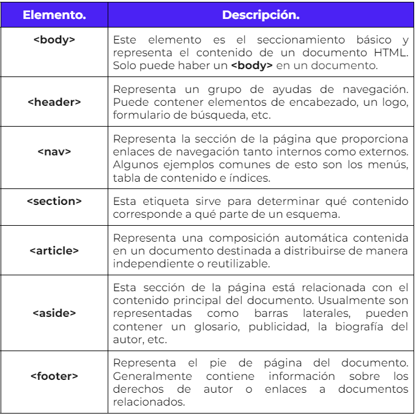
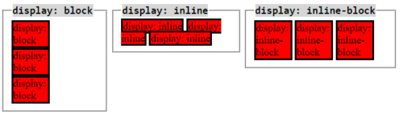

# Ejercicio Matcha 

## Sesion 1

### Github, html, css

1. ENTRA AL DIRECTORIO, 
2. INICIALIZALO EN GIT,
3.  CREA EL ARCHIVO INDEX, 
4. PREPARALO EN GIT,
5.  CONFIRMALO EN GIT, 
6. ASOCIA A REMOTO, 
7. MANDA A REMOTO

```bash
# 1 ENTRA AL DIRECTORIO, 2 INICIALIZALO EN GIT, CREA EL ARCHIVO INDEX, PREPARALO EN GIT, CONFIRMALO EN GIT, ASOCIA A REMOTO, MANDA A REMOTO

cd ejemplo_1/matcha #1
git init #2
touch index.html #3
git add * #4
git commit -m "Primer commit" #5
git remote add master https://github.com/gsanroman/matcha.git #6
git push master #7
```

Crea el contenido del sitio y despliega en un cuenta [NETLIFY](https://app.netlify.com/) asociada a gitHub

el contenido està [aqui](https://clever-fox-91388a.netlify.app/)

recurso para jugar con git: https://ohmygit.org/

## Sesion 2 modelo de caja CSS


### Etiquetas semánticas

Le indican al nevagador su contenido y jerarquía. Son para no usar DIV para todo




ver [video](https://youtu.be/PTy1qyD-Fs0)

Los elementos son de tipo *block* o de tipo *inline*

* **inline**: ocupa el tamaño de su contenido
  * img, a, span, strong,
  * Un elemento en línea no aceptará height y width. Simplemente lo ignorará.
  * **Los elementos se acomodan lado a lado. ** no hacen salto de línea sino continúan en una misma línea 

* **block**: ocupa todo el espacio disponible

  * div, p, ul, h1, header, section, aside, nav

  * **Los elementos se acomodan uno debajo de otro. ** cada vez que se presenta un elemento de este tipo se hace un salto de línea de manera predeterminada sin la necesidad de colocar una etiqueta de salto de línea.

    

**DISPLAY** altera el comportamiento de los elementos

*display:inline-block* **aplicado al elemento** los combina: los acomoda lado a lado, pero acepta width y height

*display:flex* **aplicado al contenedor**, los acomoda lado a lado




estudia [este sitio](https://developer.mozilla.org/es/docs/Learn/CSS/Building_blocks/The_box_model) y este [otro](https://developer.mozilla.org/es/docs/Web/CSS/display)

### Espaciado

los elementos tienen *padding*, o espacio interno, y *margin* espaci0 externo. **Los margenes de dos elementos contiguos se solapan, no se suman**

```css
padding: 10px 5px 5px 10px /*arriba, derecha, abajo, izquierda, manecillas del reloj*/
padding: 10px 5px  /* arriba y abajo +izquierda y derecha*/
padding: 10px 5px 20px /*arriba+ izquierda-derecha + abajo*/
	
```


### UNIDADES

* pixeles = 1cm /90
  * unidades fijas, 80 px son 80 px en cualquier dispositivo
* rem
  * unidad relativa: es relativa  la raiz del documento, el HTML. No se altera por definiciones locales
  * Relative to font-size of the root element	
* em
  * las unidades `em` son un **múltiplo del tamaño de fuente del elemento**. (definidio en un nivel superior, tal vez el body). Generalmente, el font-size para `<html>` se establece en el 100%, lo que equivale al tamaño de fuente de la configuración del navegador, cuyo valor predeterminado suele ser de 16px:
  * Relative to the font-size of the element (2em means 2 times the size of the current font)

La unidad `rem` viene de **Root EM**, pero es muy importante que el nombre no confunda. `rem` no es igual al `em` del elemento root, es **igual al `font-size` del elemento root**, que en HTML sería el elemento `<html>`.

Si el `font-size` del `<html>` es 16px, **1rem sería igual a 16px en cualquier parte del documento**. Como siempre se refiere al elemento root, no se ve afectado por el `font-size` de elementos anidados.

De W3SCHOOLS

| vw   | Relative to 1% of the width of the viewport*  | [Try it](https://www.w3schools.com/cssref/tryit.asp?filename=trycss_unit_vw) |
| ---- | --------------------------------------------- | ------------------------------------------------------------ |
| vh   | Relative to 1% of the height of the viewport* |                                                              |

\* Viewport = the browser window size. If the viewport is 50cm wide, 1vw = 0.5cm.

* A veces conviene darle tamaño cero a la fuente, àra que no rellene los espacios 


## Sesion 3 FlexBox

El elemento que recibe la propiedad `display: flex` se le conoce como `flex container`, mientras que a los elementos contenidos en el elemento en mención se le conoce como `flex items`.

 ### Propiedades del flex container

```css
.mi_flex-container{
/*paso 1: al contenedor agregar el display:flex*/
    display: flex;
/*paso 2: set el flex direction; por default es row, pero lo puedes cambiar a column*/
    flex-direction: row;
/*paso 3: el defaulñt es no wrap: internta ponder todo en la misma fila;
con wrap, cuando no caben los manda a la fila de abajo*/
    flex-wrap: wrap;

/*la forma breve es flex-flow sintetiza wrap y direction*/
/*EJE X*/

justify-content: center;/*space-around*/
/*EJE Y*/
align-items: stretch;
    
/*Si hay màs de un renglon*/
align-content: space-around
    
/*
space around respeta los margenes a la izquierda y a la derecha
space between pega los elementos a los extremos de la pantalla
space evenly empalma los margenes
    */

}
```


cuando es una columna, `justify-content` cambia a vertical y `align-items` a horizontal.

### Propiedades del flex item

```css
.mi_flex-container div:nth-child(2){
    order:2;
    flex-grow: 5; /*Tambien existe un flex-shrink, que es lo contario*/
    background-color: blue;
     align-self:flex-end; 
    
    /*Esta propiedad acepta los mismos valores de align-items y sus valores son usados para un elemento específico*/
}
```

recursos:

https://flexboxfroggy.com/#es

http://www.flexboxdefense.com/


### POSICION

* **Fixed**: usa como referencia el navegador, no el body. Asi, el elemento nunca se mueve. Toma como referencia su esquina superior izquierda


* **Sticky**: combina fixed y relative. 
  * Los elemento top, right, left y bottom no le mueven al objeto, sino la final cuando se hace scroll, en que posicion se comportara como fixed. 
  * Toma como referencia al parent, no al navegador


### Video

lleva atributos 

* src: Origen del video

* poster: imagen o portada, antes de que se reproduzca

* controls para poder reproducir, parusar, parar...

  ```html
  <video 
         src="img/video1.webm" 
         controls 
         poster="img/portada.jpg"
   ></video>	
  ```

  

version alternativa, para poder integrar multiples formatos, para que asea soportado en todos los navegadores

la etiqueta de video van sin src; deltro lde los tags de video, va una etqueta **< source >**

```html
<!--Forma 2-->
<video  controls poster="img/portada.jpg">
    <source src="img/video1.webm" type="video/webm">
    <source src="img/video2.mp4" type="video/mp4">
</video>
```

